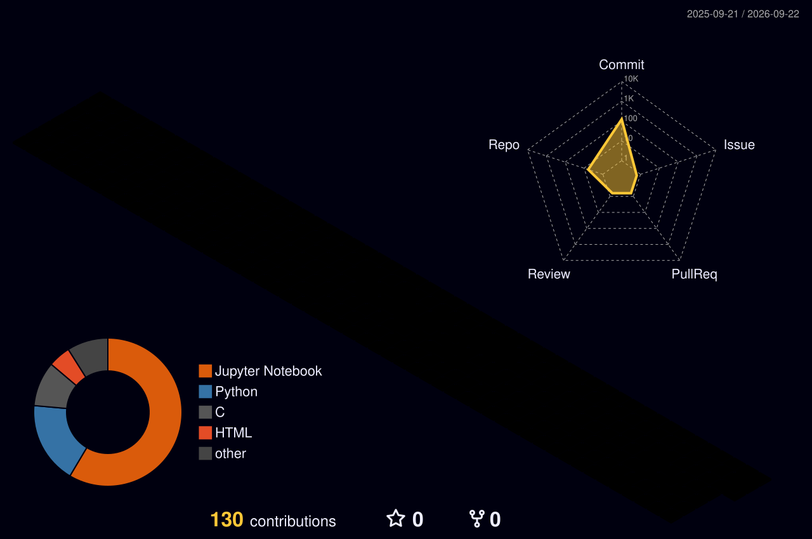

 

## 🟢 QUEM SOU EU

Olá, sou a Luanna — estudante de **Análise e Desenvolvimento de Sistemas**, apaixonada por transformar ideias em código e aprender algo novo todos os dias. Estou construindo minha base como desenvolvedora e explorando diferentes áreas da programação.

## 🟢 O QUE FAÇO

Estudo lógica de programação, desenvolvimento web e fundamentos de ciência da computação. Gosto de resolver problemas, entender como as coisas funcionam por trás dos panos e transformar teoria em projetos práticos.

## 🟢 VISÃO

Meu objetivo é crescer como desenvolvedora, contribuir com projetos que façam diferença e nunca parar de aprender. Cada linha de código é um passo a mais na jornada.

 

### 🔗 CONECTE-SE COMIGO

<table>
<tr>
<td align="center">

</td>
<td align="center">

</td>
<td align="center">

</td>
<td align="center">

</td>
</tr>
</table>

 

## 🟢 ESTATÍSTICAS

 

 

## 🟢 GRÁFICO 3D DE CONTRIBUIÇÕES

<!--START_SECTION:profile-3d-contrib-->

<!--END_SECTION:profile-3d-contrib-->

> ⚠️ Este gráfico só aparece **depois** que você ativar a GitHub Action (veja instruções abaixo).

 

## 🟢 SKILL SET

 

